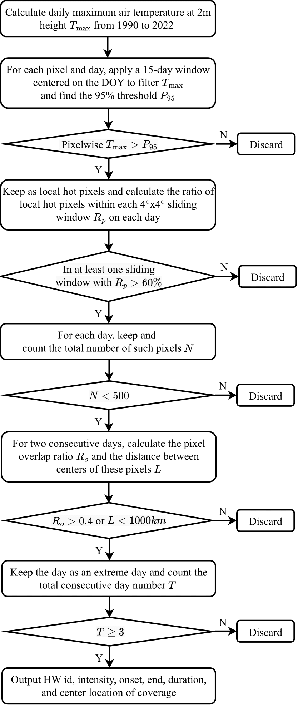

# European Heatwaves
This repository contains info about the collaborative project on Western European heatwaves in Prof Gentine's lab.

### Data description
We mainly use ERA5 data in this project. 

| ERA5          | Description |
| ---      | ---       |
| 2D Variables        |    T2m, T_2m_dew, Ts, Precip, Evapor, Potential Evapor, SWC(4 layers), LH, SH, Solar Rad, 10m UV winds, Cloud Cover|
| 2D Download URL         |    https://cds.climate.copernicus.eu/cdsapp#!/dataset/reanalysis-era5-single-levels?tab=overview|
| 2D Avaliable downloaded |    Temp: /burg/glab/users/yh3019/era5_hourly   Other: /burg/glab/users/yh3019/era5_daily |
| 3D Variables         | T, Geopotential(Z), Wind speed(U,V,omega), Relative humidity, Specific humidity| 
| 3D Download URL         |   https://cds.climate.copernicus.eu/cdsapp#!/dataset/reanalysis-era5-pressure-levels?tab=overview|
| 3D Avaliable downloaded |   /burg/glab/users/yh3019/era5_daily  |
| Temporal resolution  |    hourly(for temp only), daily(for other vars)      |
| Horizontal resolution   |    0.25 degree |
| Vertical resolution(3D only)   | original dataset use 25hPa as the vertical resolution, here only downloaded a few levels' data |
| Temporal coverage    |    1990-2022, MJJA  |
| Spatial coverage     |    [15N, 70N], [150W, 40E]                 |
| Vertical coverage(3D only)  |    500hPa, 700hPa, 850hPa, 1000hPa                 |

### Scripts description
Below lists scripts that are used to process and analyze data for this project. 
[^_^]: The codes from Yu can be run on Ginsburg with necessary packages installed.

| Scripts     | Description |
| ---      | ---       |
|era5_download_dailymean.py       | Download ERA5 data at hourly resolution (and extract the daily-scale min, mean, max). Based on [this](https://towardsdatascience.com/read-era5-directly-into-memory-with-python-511a2740bba0).|
|calc_threshold.py             | Collect T2m_max in a centered N-day window from 1990-2022, get the 95%th percentile threshold and define local extremes based on it. Using multiprocess.  |
|hw_detectracker.py             | Identify temporally consecutive (and spatially continuous) heatwave events (see the below flowchart for complete conceptual hw detection algorithm; the code is not complete, the thresholds used in this pratice may be different) [reference](https://www.sciencedirect.com/science/article/pii/S221209471930060X?via%3Dihub).  |
[^_^]:|plot_ts_map.py                   | Plot the temporal evolution of variables in three panels; plot maps of soil moisture, temp and wind speed contours.|
[^_^]:|eulerian_calc.py                      | Process Eulerian decomposition and plot the relative contributions.|

[^_^]: 
[^_^]:  

  

  <em>Fig 1. Complete HW detection algorithm </em>

