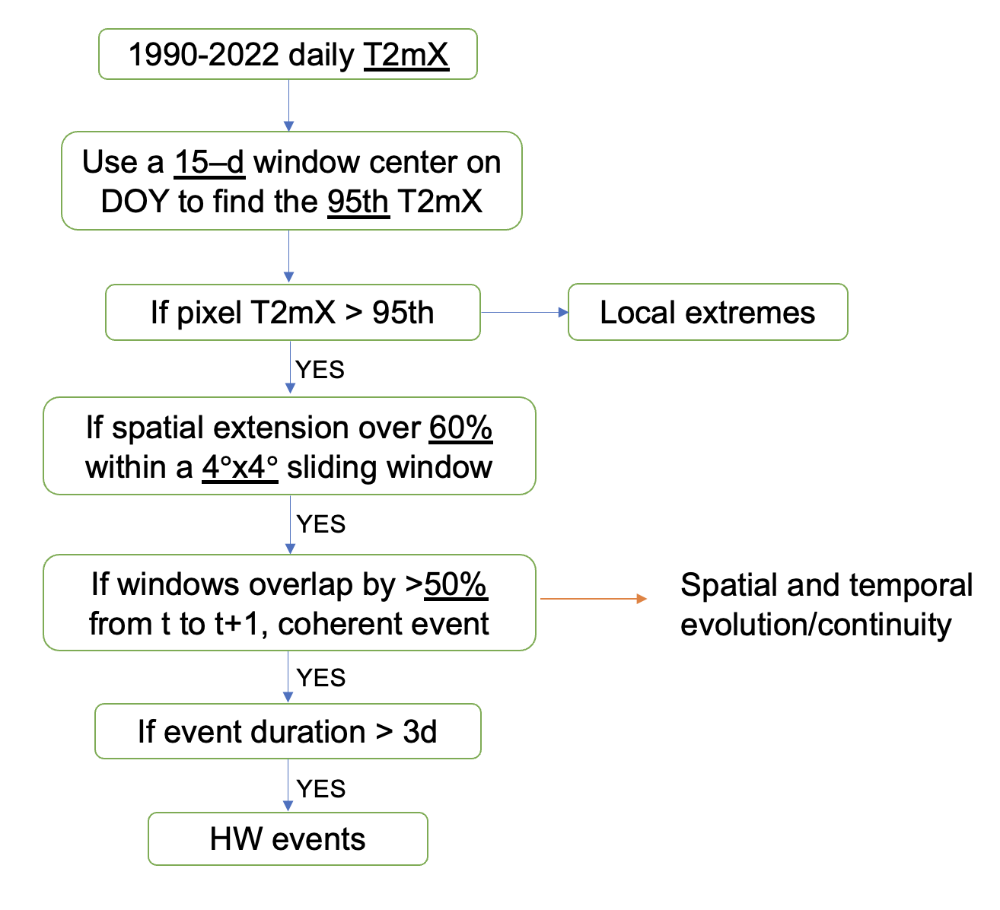

This repository contains info about the collaborative project on European heatwave in Prof Gentine's lab.

### Data description
| ERA5          | Description |
| ---      | ---       |
| 2D Variables        |    T2m, Ts, Precip, Evapor, Potential Evapor, SWC(4 layers), LH, SH, Solar Rad, 10m UV winds|
| 2D Download URL         |    https://cds.climate.copernicus.eu/cdsapp#!/dataset/reanalysis-era5-single-levels?tab=overview|
| 2D Avaliable downloaded |    Temp: /burg/glab/users/yh3019/era5_hourly   Other: /burg/glab/users/yh3019/era5_daily |
| 3D Variables         | T, Geopotential(Z), Wind speed(U,V,omega), Cloud cover, Relative humidity, Specific humidity| 
| 3D Download URL         |   https://cds.climate.copernicus.eu/cdsapp#!/dataset/reanalysis-era5-pressure-levels?tab=overview|
| 3D Avaliable downloaded |   /burg/glab/users/yh3019/era5_daily  |
| Temporal resolution  |    hourly(for temp only), daily(for other vars)      |
| Horizontal resolution   |    0.25 degree |
| Vertical resolution(3D only)   | 50 hPa (original dataset has different vertical resolutions) |
| Temporal coverage    |    1990-2022, MJJA  |
| Spatial coverage     |    [15N, 70N], [150W, 40E]                 |
| Vertical coverage(3D only)  |    [500hPa, 1000hPa]                 |

| SMAP                 | Description |
| ---      | ---       |
| Avaliable downloaded | https://github.com/os2328/GlabData/tree/main/data_cards       |

### Scripts description
| Scripts     | Description |
| ---      | ---       |
|era5_download_dailymean.py       | Download ERA5 data at hourly resolution (and extract the daily-scale min, mean, max). Based on [this](https://towardsdatascience.com/read-era5-directly-into-memory-with-python-511a2740bba0).|
|localhw_detect_mp.py             | Collect T2m_max in a centered N-day window from 1990-2022, get the 95%th percentile threshold and define local extremes based on it. Using multiprocess.  |
|track_hw_con.py             | Identify temporally consecutive and spatially continuous heatwave events (see the below flowchart for complete hw detection algorithm).  |
|plot_ts_map.py                   | Plot the temporal evolution of variables in three panels; plot maps of soil moisture, temp and wind speed contours.|
|eulerian_calc.py                      | Process Eulerian decomposition and plot the relative contributions.|

[^_^]: (  )

### Links to method source
| Description | Links |
| ---      | ---       |
|Lagrangian trajectories                     | https://github.com/Novarizark/easy-era5-trck|
|Eulerian decomposition                      | https://www.nature.com/articles/s43247-020-00048-9.pdf|
|Dry static energy convergence decomposition | https://agupubs.onlinelibrary.wiley.com/doi/full/10.1029/2021AV000619|
|Tracking heatwaves                          | https://www.sciencedirect.com/science/article/pii/S221209471930060X?via%3Dihub     https://iopscience.iop.org/article/10.1088/1748-9326/7/1/014023/meta|

### Meeting Summaries
* [2022_08_05](https://docs.google.com/document/d/1eLhVIBYlDIeIwSVxXDPkn1ahWPNq4s43bBIwsrZ2c0A/edit)
* [2022_08_19](https://docs.google.com/document/d/1kyXU9GH-CSaeEYUSKSKinRIRnop4iyVyNQrGNIHiqrU/edit)
* [2022_11_11](https://docs.google.com/document/d/1jjp_Xvnm5Iyhgx3X7fQa-n9neDYs8umnw6UduITXFqw/edit)
